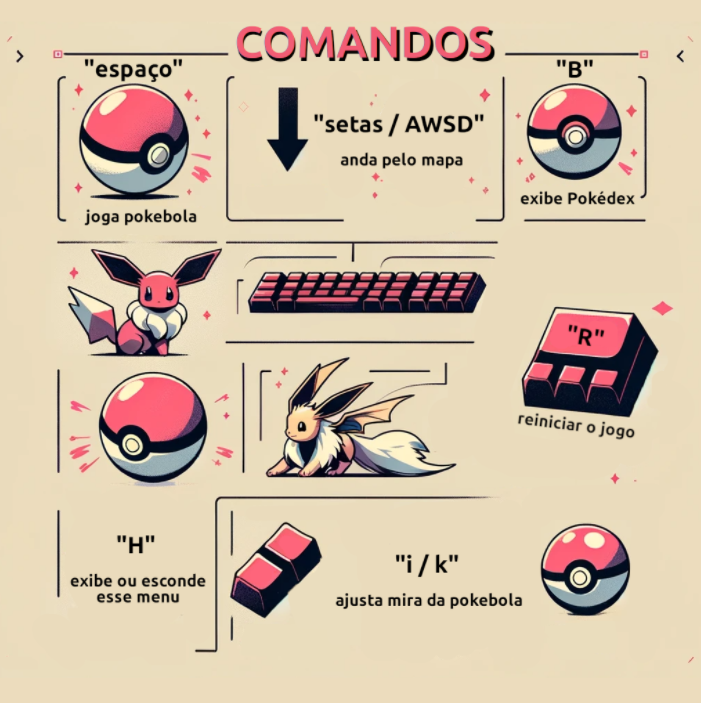
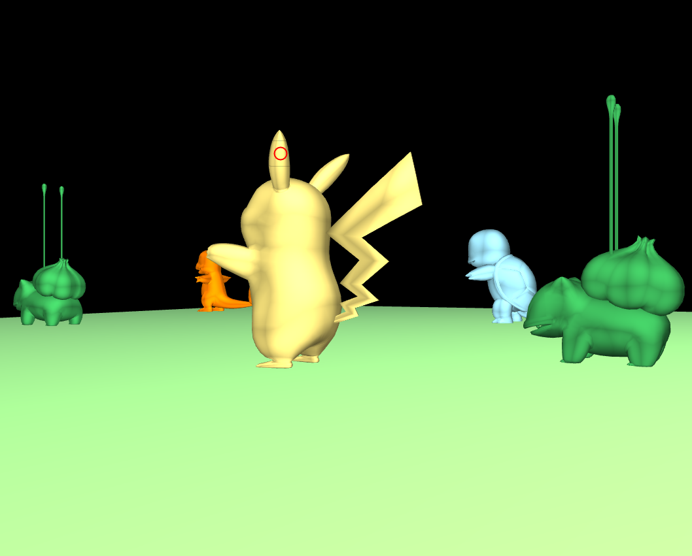
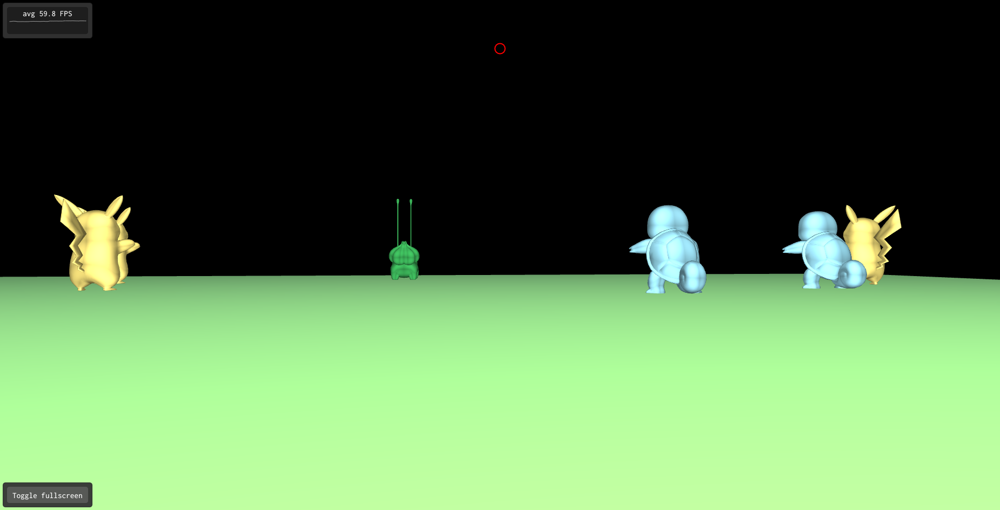

# COMPUTAÇÃO GRÁFICA - Aplicação Interativa 3D

## Integrantes 

**Nome:** Gabriel Fernandes &nbsp; &nbsp; &nbsp; &nbsp; &nbsp; &nbsp; &nbsp; &nbsp; &nbsp; &nbsp; **RA:** 11201720718
<br/>
**Nome:** Matheus Alexandre de Sena    &nbsp; &nbsp;  **RA:** 11201720166

## Link para WebAssembly

https://matthsena.github.io/pokemon-legends-webgl/pokemon-gl/

## Resumo da aplicação

O projeto `pokemon-legends-webgl` é uma evolução do segundo projeto `pokemon-gl` e também teve como inspiração o jogo Pokémon GO, muito jogado desde seu lançamento em 2016.
Neste projeto, o usuário da aplicação está em um cenário em primeira pessoa, onde ele procura Pokémons pelo espaço e faz o lançamento de pokebolas sob eles, podendo fazer a captura das espécies. 
Como evolução, nesta versão trouxemos um cenário com iluminação e textura, adicionando melhorias na jogabilidade fazendo a implementação de um menu Help, mira para a Pokebola na captura de Pokemon e gravidade no cenário onde a Pokebola é arremessada. Também foram realizadas melhorias quanto o objeto da Pokebola e a animação pós captura de um Pokémon.



Para este projeto, foi utilizado a biblioteca `ABCg` (https://github.com/hbatagelo/abcg) disponibilizada no curso de Computação Gráfica 2023.3 na Universidade Federal do ABC.  

## Comandos

ESPAÇO: Dispara a Pokébola

**R**: Reinicia o jogo

**B**: Abre o menu Pokédex, onde você pode ver os Pokémons capturados

**A / Seta esquerda**: Movimenta para a esquerda

**D / Seta para direita**: Movimenta para a direita

**W / Seta para cima**: Movimenta para frente

**S / Seta para baixo**: Movimenta para trás

**I**: Movimenta a mira para cima

**J**: Movimenta a mira para baixo

**H**: Abre o menu "Help"


## MENU DE AJUDA




## Visão geral da implementação:

## window.hpp:

A classe Window é definida e herda da classe abcg::OpenGLWindow, que é uma parte da biblioteca abcgOpenGL para criar janelas gráficas.

### Variáveis importantes:

`struct Pokemon`: Variável struct que armazena os VBOs, EBOs, nome e outras características de cada Pokémon. Dessa forma, não temos uma variável global para essas definições, mas uma para cada obj.

```c++
  struct Pokemon {
    GLuint m_vao{};
    GLuint m_vbo{};
    GLuint m_ebo{};
    std::vector<Vertex> m_vertices;
    std::vector<GLuint> m_indices;
    glm::vec4 m_color{};
    std::string m_name{};
    bool m_captured{false};
    glm::vec3 m_position{0, 0, 0};
  };
```


`m_pokemons_list`: Hashmap que guarda os dados de VAO, VBO, EBO, Vertices e Indices de cada Pokémon existente na lista de arquivos `.obj`.
```c++
std::unordered_map<std::string, Pokemon> m_pokemons_list;
```

`m_modelPaths`: Variável que armazena uma lista dos arquivos .obj que podem ser renderizados na aplicação de forma aleatória.
```c++
  std::vector<std::string> m_modelPaths = {"charmander.obj", "bulbasaur.obj"};
```

`m_miraPosition`: Variável que inicializa a mira na posição correta {0, 0}.

`GRAVITY`: Variável que define a gravidade sob o lançamento da pokebola.

`m_font`: Variável utilizada para a renderização dos textos que são apresentados na tela (Escapou!, Capturado!, Jogo Reiniciado)


## window.cpp:

O arquivo window.cpp é composto pelas funções utilizadas para a construção lógica da aplicação renderizada. Abaixo segue um resumo descritivo de cada função presente no arquivo:

`onEvent`: Função que manipula os eventos SDL, como pressionar as teclas do teclado. 
I e K: Move a mira para cima e para baixo. Também foi adicionado um max e min para restringir a mira dentro da tela
Espaço: Lança a pokébola através da chamada de `launchPokeball`
R: Reinicia o jogo através da chamada de `restartGameThread` 
B: Abre o Pokédex com a listagem de Pokémons capturados a partir de `m_showPokedex`

Também foram definidas as setas e as teclas AWSD para o comando de movimentação do usuário em primeira pessoa.

`onCreate`: Função chamada para inicializar a aplicação. Os shaders são chamados nos arquivos `lookat.frag` e `lookat.vert`. Além disso, no onCreate é aplicada a configuração do nome e as cores dos Pokémons, conforme o trecho de código abaixo:

```c++
  for (int i = 0; i < 2; i++) {
    auto color = glm::vec4(0.0f, 0.0f, 0.0f, 1.0f);
    std::string name = "";

    if (m_modelPaths[i] == "charmander.obj") {
      color = glm::vec4(1.0f, 0.5f, 0.0f, 1.0f);
      name = "Charmander";
    } else if (m_modelPaths[i] == "Bulbasaur.obj") {
      color = glm::vec4(0.2f, 0.6f, 0.3f, 1.0f);
      name = "Bulbasaur";
    }

    auto const [vertices_pokemon, indices_pokemon] =
        loadModelFromFile(assetsPath + m_modelPaths[i]);

    GLuint tmp_VAO{};
    GLuint tmp_VBO{};
    GLuint tmp_EBO{};

    // Generate VBO
    abcg::glGenBuffers(1, &tmp_VBO);
    abcg::glBindBuffer(GL_ARRAY_BUFFER, tmp_VBO);
    abcg::glBufferData(GL_ARRAY_BUFFER,
                       sizeof(vertices_pokemon.at(0)) * vertices_pokemon.size(),
                       vertices_pokemon.data(), GL_STATIC_DRAW);
    abcg::glBindBuffer(GL_ARRAY_BUFFER, 0);

    // Generate EBO
    abcg::glGenBuffers(1, &tmp_EBO);
    abcg::glBindBuffer(GL_ELEMENT_ARRAY_BUFFER, tmp_EBO);
    abcg::glBufferData(GL_ELEMENT_ARRAY_BUFFER,
                       sizeof(indices_pokemon.at(0)) * indices_pokemon.size(),
                       indices_pokemon.data(), GL_STATIC_DRAW);
    abcg::glBindBuffer(GL_ELEMENT_ARRAY_BUFFER, 0);

    // Create VAO
    abcg::glGenVertexArrays(1, &tmp_VAO);

    // Bind vertex attributes to current VAO
    abcg::glBindVertexArray(tmp_VAO);

    abcg::glBindBuffer(GL_ARRAY_BUFFER, tmp_VBO);
    auto const positionAttribute{
        abcg::glGetAttribLocation(m_program, "inPosition")};
    abcg::glEnableVertexAttribArray(positionAttribute);
    abcg::glVertexAttribPointer(positionAttribute, 3, GL_FLOAT, GL_FALSE,
                                sizeof(Vertex), nullptr);
    abcg::glBindBuffer(GL_ARRAY_BUFFER, 0);

    abcg::glBindBuffer(GL_ELEMENT_ARRAY_BUFFER, tmp_EBO);
...
  
  }
```

Os VBOs e EBOs para cada Pokémon é definido separadamente através da variável Pokemon apresentada anteriormente na seção do window.hpp. Desta forma, definidos assim dentro do onCreate:

```c++
...
    m_pokemons_list[m_modelPaths[i]] =
        Pokemon{tmp_VAO,         tmp_VBO, tmp_EBO, vertices_pokemon,
                indices_pokemon, color,   name};
  }
```


A posição e o tipo de Pokémon que sera renderizado é construído pela lógica abaixo, onde as duas definições são feitas de forma aleatória pela função `rd_poke_position` e `rd_poke_model`, respectivamente:

```c++
// Definindo posição inicial dos pokemons
  m_randomEngine.seed(
      std::chrono::steady_clock::now().time_since_epoch().count());

  std::uniform_real_distribution<float> rd_poke_position(-5.0f, 5.0f);
  std::uniform_int_distribution<int> rd_poke_model(0, m_modelPaths.size() - 1);

  // inicializando pokemons
  for (int i = 0; i < m_num_pokemons; ++i) {
    m_pokemon[i] = m_pokemons_list[m_modelPaths[rd_poke_model(m_randomEngine)]];
    m_pokemon[i].m_position = glm::vec3(rd_poke_position(m_randomEngine), 0,
                                        rd_poke_position(m_randomEngine));
  }

```

`loadModelFromFile`: Função de carregamento dos arquivos .obj. O retorno dela é uma tupla com os vertices e indices das posições do objeto (Pokémon ou Pokébola):

```c++
std::tuple<std::vector<Vertex>, std::vector<GLuint>>
Window::loadModelFromFile(std::string_view path) {

  .
  .
  .

  return std::make_tuple(vertices, indices);
}
```

`safeGuard`: Função que garante que os objetos não serão renderizados na posição 0. Foi aplicado 1.5 e -1.5f no x para garantir que não exista nenhum confronto entre objetos e a câmera em primeira pessoa.


Também foi criado um conceito de safeRender na aplicação. A ideia é evitar que um Pokémon seja gerado em cima de outro Pokémon. Quando geramos um Pokémon também é gerada uma posição aleatória para ele. A partir dessa posição é verificado se não conflita com as posições dos Pokémons existentes, fazendo a verificação através da função `distance`. Caso tenha uma posição menor que 1, geramos uma nova distância aleatória até não existir esse conflito de distâncias. O trecho de código abaixo exemplifica o método:

```c++
 // inicializando pokemons
  for (int i = 0; i < m_num_pokemons; ++i)
  {
    std::string objFile = m_modelPaths[rd_poke_model(m_randomEngine)];
    glm::vec3 position;

    bool positionIsValid = false;
    while (!positionIsValid)
    {
      position = glm::vec3(safeGuard(rd_poke_position(m_randomEngine)), 0,
                           safeGuard(rd_poke_position(m_randomEngine)));

      positionIsValid = true;
      for (const auto &pokemon : pokemons_spawned)
      {
        if (glm::distance(position, pokemon.getPosition()) < 1.0f)
        {
          positionIsValid = false;
          break;
        }
      }
    }

    Pokemon pokemon;
    pokemon.create(m_model, assetsPath, objFile, position);

    pokemons_spawned.push_back(pokemon);
  }
```


`onPaint`: Função que renderiza a cena, utilizando shaders para renderizar os Pokémons, a Pokébola e o chão. A renderização de cada Pokémon acontece conforme o código abaixo:

```c++
// renderizando cada pokemon
  for (int i = 0; i < m_num_pokemons; ++i) {
    auto selectedPokemon = m_pokemon[i];

    abcg::glBindVertexArray(selectedPokemon.m_vao);

    glm::mat4 model{1.0f};
    // renderizacao condicional caso nao tenha sido capturado
    if (selectedPokemon.m_captured == false) {
      model = glm::translate(model, selectedPokemon.m_position);
      model = glm::rotate(model, glm::radians(90.0f), glm::vec3(0, 1, 0));
      model = glm::scale(model, glm::vec3(0.02f));

      abcg::glUniformMatrix4fv(m_modelMatrixLocation, 1, GL_FALSE,
                               &model[0][0]);
      abcg::glUniform4f(m_colorLocation, selectedPokemon.m_color.r,
                        selectedPokemon.m_color.g, selectedPokemon.m_color.b,
                        selectedPokemon.m_color.a);
      abcg::glDrawElements(GL_TRIANGLES, selectedPokemon.m_indices.size(),
                           GL_UNSIGNED_INT, nullptr);
    }
  }
```

`onPaintUI`: Define uma interface de usuário (UI) usando a biblioteca ImGui. 

A mira é renderizada através da definição de variáveis como `miraRadius` que define o raio da mira e `miraColor`que define a cor da mira. Abaixo temos o código onde na primeira etapa as variáveis são definidas e na segunda etapa o desenho da mira é renderizado:

```c++
   {
      float miraRadius = 10.0f;
      ImU32 miraColor = IM_COL32(255, 0, 0, 255);
      float lineThickness = 2.0f;
      ImVec2 center(m_viewportSize.x / 2.0f, m_miraPosition.y / 2.0f);

      // Ajustar o tamanho da janela para garantir que a mira caiba completamente
      ImVec2 windowSize = ImVec2(miraRadius * 4, miraRadius * 4);
      ImVec2 windowPos = ImVec2(center.x - windowSize.x / 2, center.y - windowSize.y / 2);

      ImGui::SetNextWindowPos(windowPos, ImGuiCond_Always);
      ImGui::SetNextWindowSize(windowSize);
      ImGui::SetNextWindowBgAlpha(0);

      ImGui::Begin("MiraWindow", nullptr, ImGuiWindowFlags_NoDecoration | ImGuiWindowFlags_NoInputs | ImGuiWindowFlags_NoNav);
      ImDrawList *drawList = ImGui::GetWindowDrawList();

      drawList->AddCircle(center, miraRadius, miraColor, 0, lineThickness);

      ImGui::End();
    }
```

A ImGui é utizada no `onPaintUI` para exibir as frases na tela durante a execução da aplicação, conforme o código abaixo:

```c++
    if (m_currentState == PokemonState::Captured) {
      text = "Capturado!";
      textWidth = ImGui::CalcTextSize(text.c_str()).x;
      ImGui::SetCursorPosX((windowWidth - textWidth) * 0.5f);
      ImGui::TextUnformatted(text.c_str());

    } else if (m_currentState == PokemonState::Escaped) {
      text = "Escapou!";
      textWidth = ImGui::CalcTextSize(text.c_str()).x;
      ImGui::SetCursorPosX((windowWidth - textWidth) * 0.5f);
      ImGui::TextUnformatted(text.c_str());
    }

    if (m_restarted == true) {
      text = "Jogo reiniciado";
      textWidth = ImGui::CalcTextSize(text.c_str()).x;
      ImGui::SetCursorPosX((windowWidth - textWidth) * 0.5f);
      ImGui::TextUnformatted(text.c_str());
    }

    ImGui::PopFont();
    ImGui::End();

    text = "";

    // JANELA DA POKEDEX
    if (m_showPokedex) {
      ImGui::Begin("Pokédex", nullptr, ImGuiWindowFlags_NoFocusOnAppearing);
      ImGui::Text("Pokémons capturados:");
    }
```

`onResize`: É chamado quando a janela é redimensionada e atualiza o tamanho do viewport da câmera.

`onDestroy`: É chamado quando a janela é destruída e é usado para limpar os recursos OpenGL.

`onUpdate`: É chamado para atualizar a lógica do jogo a cada quadro, como a movimentação da câmera.

`launchPokeball`: Chamada quando o jogador pressiona ESPAÇO para fazer o lançamento da Pokébola.

`updatePokeballPosition`: Atualiza a posição da Pokébola durante o movimento.

Uma das grandes novidades é a definição de probabilidade para a captura de um Pokémon quando você acerta a Pokébola dentro de um paralelepípedo construído em torno do Pokémon. O código abaixo realiza as verificações com base nos dados de altura e largura do Pokémon que são usados para definir esse paralelepípedo:

```c++
    // Verifica se colidiu com algum pokemon
    for (auto &pokemon : pokemons_spawned)
    {
      if (pokemon.getPokemonCaptured() == false)
      {
        // float distance = glm::distance(m_pokeballPosition, pokemon.getPosition());

        // Altura e largura do pokemon
        const float pokemonHeight = pokemon.getPokemonHeight();
        const float pokemonWidth = pokemon.getPokemonWidth();
        // verifica se a pokebola está dentro do paralelepipedo do pokemon considerando todos os eixos

        if ((m_pokeballPosition.x - pokeballRadius) > (pokemon.getPosition().x - pokemonWidth / 2.0f) &&
            (m_pokeballPosition.x - pokeballRadius) < (pokemon.getPosition().x + pokemonWidth / 2.0f) &&
            (m_pokeballPosition.y - pokeballRadius) > (pokemon.getPosition().y - pokemonHeight / 2.0f) &&
            (m_pokeballPosition.y - pokeballRadius) < (pokemon.getPosition().y + pokemonHeight / 2.0f) &&
            (m_pokeballPosition.z - pokeballRadius) > (pokemon.getPosition().z - pokemonWidth / 2.0f) &&
            (m_pokeballPosition.z - pokeballRadius) < (pokemon.getPosition().z + pokemonWidth / 2.0f))
        {
          // Colisão detectada
          fmt::print("Pokébola colidiu com Pokémon!\n");

          // probabilidade de captura 45%
          std::uniform_real_distribution<float> rd_poke_capture(0.0f, 1.0f);

          if (rd_poke_capture(m_randomEngine) < 0.45f)
          {
            m_currentState = PokemonState::Captured;

            pokemon.setPokemonCaptured(true);
            m_pokedex_pokemons.insert(pokemon.getPokemonName());

            glm::vec3 current_pokemon_pos = pokemon.getPosition();

            m_pokeball_render.setPosition(glm::vec3(current_pokemon_pos.x, m_pokeball_render.getPokeballRadius(), current_pokemon_pos.z));
          }
          else if (m_currentState != PokemonState::Captured)
          {
            m_currentState = PokemonState::Escaped;
            m_pokeball_render.setPosition(m_camera.getEyePosition());
            m_pokeball_render.setPokeballLaunched(false);
          }

          break;
        }
      }
    }
```

`backToLive`: Utilizada para atualizar as informações do jogo em tempo de execução.

`restartGame`: Chamada para reiniciar o jogo.

## main.cpp:

O arquivo main.cpp inicia a aplicação, criando uma instância da classe Window e realizando as configurações da janela de exibição (width, height, title). Em seguida, inicia a aplicação com `app.run(window)`.

## model.cpp:

O arquivo model.cpp implementa as funções da classe Model, que foi criada para fazer o gerenciamento e renderização dos modelos 3D. Aqui foram criadas funções para definição de VBOs e EBOs para armazenar vértices e índices de um modelo (`createBuffers`), o carregamento de um modelo 3D a partir de um .obj (`loadObj`), a renderização do modelo (`render`), aplicação de textura (`renderTexture`), carregamento de uma textura associando um texture ID (`loadDiffuseTexture`), configuração do VAO para o modelo (`setupVAO`), normalização dos modelos para estarem de acordo com o espaço de coordenadas (`standardize`) e para calcular as normais dos vértices, garantindo a iluminação correta (`computeNormals`).

## model.hpp:

O arquivo `model.hpp` define a classe Model, utilizada para o gerenciamento e renderização de modelos 3D.

## globals.hpp:

O arquivo `globals.hpp` classe Globals para adicionar variáveis globais, como a CATCH_FRAME_TIME que diz quantos frames passam até concretizar a captura de um Pokémon:

```c++
#ifndef GLOBALS_HPP_
#define GLOBALS_HPP_

class Globals
{
  public:
    const float CATCH_FRAME_TIME = 90.0f;
};

#endif
```


## ground.cpp:

O arquivo ground.cpp é composto pelas funções utilizadas na classe Ground, que são utilizadas para criar o VAO e VBO do chão (10x10). Aqui estamos fazendo a renderização da textura do terreno com um arquivo ground.png que é carregado partir da função `Ground::create` e renderizado no cenário a partir da função`Ground::paint`. A atualização da iluminação através da função `Ground::update`, onde é configurada a posição da luz pela variável `lightPos`, o brilho pela variável `shininess` e `Is` definida pela cor da luz especular.

## ground.hpp: 

O arquivo ground.hpp define a classe Ground que é utilizada para criação e renderização do chão.

## camera.cpp: 

O arquivo camera.cpp é composto pelas funções utilizadas na classe Camera para calcular as matrizes de projeção e visualização, bem como manipular a posição e orientação da câmera.
Para a classe Camera, foi realizado um aumento do campo de visão através do aumento do volume de visualização, onde podemos enxergar mais Pokémons ao redor, conforme imagem abaixo:




## camera.hpp:

O arquivo camera.hpp define a classe Camera que é usada para a visualização da cena pelo usuário.

Foram definidos 2 getters para capturar e retornar a posição da camêra (m_eye) e o ponto para onde a câmera está olhando (m_at), conforme abaixo:

```c++
// ADICIONADO - GETTERS DE POSICAO DA CAMERA
  glm::vec3 const getEyePosition() const { return m_eye; }
  glm::vec3 const getLookAtPoint() const { return m_at; }
```

Eles são utilizados na função de lançamento da pokébola `launchPokeball` para realizar os cálculos de posição da pokébola e posição de lançamento, conforme o código abaixo do arquivo `window.cpp`:

```c++
void Window::launchPokeball() {
  if (!m_pokeballLaunched) {
    m_currentState = PokemonState::Live;

    fmt::print("Pokebola vai!\n");

    m_pokeballPosition = m_camera.getEyePosition();

    glm::vec3 launchDirection =
        glm::normalize(m_camera.getLookAtPoint() - m_camera.getEyePosition());
    float launchSpeed = 2.0f;
    m_pokeballVelocity = launchDirection * launchSpeed;
    m_pokeballLaunched = true;
  }
}
```

## pokeball.cpp:

O arquivo `pokeball.cpp` define as funções utilizadas para o gerenciamento e renderização da Pokebola, onde temos a função de criação que utiliza do `loadObj` para carregar o .obk da Pokebola, `setupVAO` definindo os VBOs, EBOs e VAO e `loadDiffuseTexture` carregando uma textura através do arquivo pokeball.pnj:


OBS: Todas as texturas foram feitas manualmente, pois as texturas prontas não funcionaram tão bem mesmo com alterações nos shaders.

## pokeball.hpp:

O `arquivo pokeball.hpp` define a classe Pokeball que possui os atributos da Pokebola, definindo iluminação, textura e rotação.


## pokemon.cpp:

O arquivo `pokemon.cpp` define as funções utilizadas para o gerenciamento, renderização e interação dos Pokémons dentro da aplicação. O método `create` inicializa criando shaders de vértices e fragmentos para a textura do Pokémon, carrega os modelos de Pokémon e textura para quando ele está no jogo e para quando for capturado (arquivo captured.pnj), deixando-o com uma aparência toda avermelhada.

Também temos a função `setPokemonName` que extrai o nome dos Pokémons a partir do arquivo .obj, e a partir disso é definido as características do Pokémon.
A função `Paint` implementa as renderizações e texturas que dão o efeito de animação quando um Pokémon foi capturado. Ele aplica um efeito de escala diminuindo gradualmente quando o Pokémon é capturado e mudança da sua textura.

## pokemon.hpp:

O arquivo `pokemon.hpp` define a classe Pokemon que possui os métodos de gerenciamento e trasnformações entre a renderização de um Pokémon no cenário de origem e durante sua captura.
O dimensionamento do Pokémon para posterior utilização desses dados nos métodos de captura é definido no seguinte trecho de código, onde é definido altura, largura e raio do Pokémon:

```c++
 float getPokemonWidth() const { return m_pokemon_width; }
  float getPokemonHeight() const { return m_pokemon_height; }

  bool getInPokebell() { return inPokebell; }

private:
  Globals g;

  float m_pokemon_radius{0};

  float m_pokemon_width{0};
  float m_pokemon_height{0};

  GLuint m_VAO{};
  GLuint m_VBO{};
  GLuint m_EBO{};
  GLuint m_pokemon_program{};

  GLuint m_diffuse_texture{};
  GLuint m_captured_texture{};
```
 